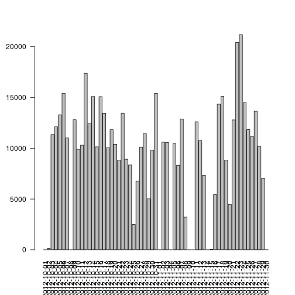
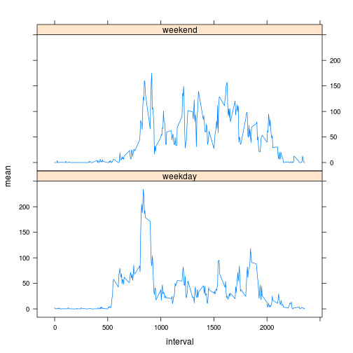

# Reproducible Research: Peer Assessment 1


## Loading and preprocessing the data
I download the file from: https://d396qusza40orc.cloudfront.net/repdata%2Fdata%2Factivity.zip,
unzip it and then read it with R:

```r
data<-read.csv("activity.csv")
dateDownload<-date()
```

## What is mean total number of steps taken per day?
In the barplot we can see the total number of steps per day.

```r
barplot(tapply(data$steps, data$date, sum,na.rm=TRUE), las=2)
```

 

```r
stepsPerDay<-tapply(data$steps, data$date, sum,na.rm=TRUE)
summary(stepsPerDay)[4]
```

```
## Mean 
## 9350
```

```r
summary(stepsPerDay)[3]
```

```
## Median 
##  10400
```
The mean of steps per day is 9354 and the median is 10400.

## What is the average daily activity pattern?

The time series plot shows the 5-minute interval (x-axis) and the average number of steps taken, averaged across all days (y-axis):

```r
plot(tapply(data$steps, data$interval, mean,na.rm=TRUE), type = "l")
```

 

```r
stepsPerInterval<-tapply(data$steps, data$interval, mean,na.rm=TRUE)
which.max(stepsPerInterval)
```

```
## 835 
## 104
```

```r
stepsPerInterval[104]
```

```
##   835 
## 206.2
```

The 5-minute interval, on average across all the days in the dataset, that contains the maximum number of steps is 835.
With 206.1698 steps.


## Imputing missing values
There are 2304 NAs on this dataset.
By inspecting it a little I saw that all NAs correspond to the whole intervals of 8 complete days (2012-10-01,2012-10-08,2012-11-01,2012-11-04,2012-11-09,2012-11-10,2012-11-14 and 2012-11-30).
I prefer to work without these days, with the reduced dataset of the real mesures that were taken.

```r
sum(is.na(data))
```

```
## [1] 2304
```

```r
newData<-data
which(is.na(newData))
```

```
##    [1]     1     2     3     4     5     6     7     8     9    10    11
##   [12]    12    13    14    15    16    17    18    19    20    21    22
##   [23]    23    24    25    26    27    28    29    30    31    32    33
##   [34]    34    35    36    37    38    39    40    41    42    43    44
##   [45]    45    46    47    48    49    50    51    52    53    54    55
##   [56]    56    57    58    59    60    61    62    63    64    65    66
##   [67]    67    68    69    70    71    72    73    74    75    76    77
##   [78]    78    79    80    81    82    83    84    85    86    87    88
##   [89]    89    90    91    92    93    94    95    96    97    98    99
##  [100]   100   101   102   103   104   105   106   107   108   109   110
##  [111]   111   112   113   114   115   116   117   118   119   120   121
##  [122]   122   123   124   125   126   127   128   129   130   131   132
##  [133]   133   134   135   136   137   138   139   140   141   142   143
##  [144]   144   145   146   147   148   149   150   151   152   153   154
##  [155]   155   156   157   158   159   160   161   162   163   164   165
##  [166]   166   167   168   169   170   171   172   173   174   175   176
##  [177]   177   178   179   180   181   182   183   184   185   186   187
##  [188]   188   189   190   191   192   193   194   195   196   197   198
##  [199]   199   200   201   202   203   204   205   206   207   208   209
##  [210]   210   211   212   213   214   215   216   217   218   219   220
##  [221]   221   222   223   224   225   226   227   228   229   230   231
##  [232]   232   233   234   235   236   237   238   239   240   241   242
##  [243]   243   244   245   246   247   248   249   250   251   252   253
##  [254]   254   255   256   257   258   259   260   261   262   263   264
##  [265]   265   266   267   268   269   270   271   272   273   274   275
##  [276]   276   277   278   279   280   281   282   283   284   285   286
##  [287]   287   288  2017  2018  2019  2020  2021  2022  2023  2024  2025
##  [298]  2026  2027  2028  2029  2030  2031  2032  2033  2034  2035  2036
##  [309]  2037  2038  2039  2040  2041  2042  2043  2044  2045  2046  2047
##  [320]  2048  2049  2050  2051  2052  2053  2054  2055  2056  2057  2058
##  [331]  2059  2060  2061  2062  2063  2064  2065  2066  2067  2068  2069
##  [342]  2070  2071  2072  2073  2074  2075  2076  2077  2078  2079  2080
##  [353]  2081  2082  2083  2084  2085  2086  2087  2088  2089  2090  2091
##  [364]  2092  2093  2094  2095  2096  2097  2098  2099  2100  2101  2102
##  [375]  2103  2104  2105  2106  2107  2108  2109  2110  2111  2112  2113
##  [386]  2114  2115  2116  2117  2118  2119  2120  2121  2122  2123  2124
##  [397]  2125  2126  2127  2128  2129  2130  2131  2132  2133  2134  2135
##  [408]  2136  2137  2138  2139  2140  2141  2142  2143  2144  2145  2146
##  [419]  2147  2148  2149  2150  2151  2152  2153  2154  2155  2156  2157
##  [430]  2158  2159  2160  2161  2162  2163  2164  2165  2166  2167  2168
##  [441]  2169  2170  2171  2172  2173  2174  2175  2176  2177  2178  2179
##  [452]  2180  2181  2182  2183  2184  2185  2186  2187  2188  2189  2190
##  [463]  2191  2192  2193  2194  2195  2196  2197  2198  2199  2200  2201
##  [474]  2202  2203  2204  2205  2206  2207  2208  2209  2210  2211  2212
##  [485]  2213  2214  2215  2216  2217  2218  2219  2220  2221  2222  2223
##  [496]  2224  2225  2226  2227  2228  2229  2230  2231  2232  2233  2234
##  [507]  2235  2236  2237  2238  2239  2240  2241  2242  2243  2244  2245
##  [518]  2246  2247  2248  2249  2250  2251  2252  2253  2254  2255  2256
##  [529]  2257  2258  2259  2260  2261  2262  2263  2264  2265  2266  2267
##  [540]  2268  2269  2270  2271  2272  2273  2274  2275  2276  2277  2278
##  [551]  2279  2280  2281  2282  2283  2284  2285  2286  2287  2288  2289
##  [562]  2290  2291  2292  2293  2294  2295  2296  2297  2298  2299  2300
##  [573]  2301  2302  2303  2304  8929  8930  8931  8932  8933  8934  8935
##  [584]  8936  8937  8938  8939  8940  8941  8942  8943  8944  8945  8946
##  [595]  8947  8948  8949  8950  8951  8952  8953  8954  8955  8956  8957
##  [606]  8958  8959  8960  8961  8962  8963  8964  8965  8966  8967  8968
##  [617]  8969  8970  8971  8972  8973  8974  8975  8976  8977  8978  8979
##  [628]  8980  8981  8982  8983  8984  8985  8986  8987  8988  8989  8990
##  [639]  8991  8992  8993  8994  8995  8996  8997  8998  8999  9000  9001
##  [650]  9002  9003  9004  9005  9006  9007  9008  9009  9010  9011  9012
##  [661]  9013  9014  9015  9016  9017  9018  9019  9020  9021  9022  9023
##  [672]  9024  9025  9026  9027  9028  9029  9030  9031  9032  9033  9034
##  [683]  9035  9036  9037  9038  9039  9040  9041  9042  9043  9044  9045
##  [694]  9046  9047  9048  9049  9050  9051  9052  9053  9054  9055  9056
##  [705]  9057  9058  9059  9060  9061  9062  9063  9064  9065  9066  9067
##  [716]  9068  9069  9070  9071  9072  9073  9074  9075  9076  9077  9078
##  [727]  9079  9080  9081  9082  9083  9084  9085  9086  9087  9088  9089
##  [738]  9090  9091  9092  9093  9094  9095  9096  9097  9098  9099  9100
##  [749]  9101  9102  9103  9104  9105  9106  9107  9108  9109  9110  9111
##  [760]  9112  9113  9114  9115  9116  9117  9118  9119  9120  9121  9122
##  [771]  9123  9124  9125  9126  9127  9128  9129  9130  9131  9132  9133
##  [782]  9134  9135  9136  9137  9138  9139  9140  9141  9142  9143  9144
##  [793]  9145  9146  9147  9148  9149  9150  9151  9152  9153  9154  9155
##  [804]  9156  9157  9158  9159  9160  9161  9162  9163  9164  9165  9166
##  [815]  9167  9168  9169  9170  9171  9172  9173  9174  9175  9176  9177
##  [826]  9178  9179  9180  9181  9182  9183  9184  9185  9186  9187  9188
##  [837]  9189  9190  9191  9192  9193  9194  9195  9196  9197  9198  9199
##  [848]  9200  9201  9202  9203  9204  9205  9206  9207  9208  9209  9210
##  [859]  9211  9212  9213  9214  9215  9216  9793  9794  9795  9796  9797
##  [870]  9798  9799  9800  9801  9802  9803  9804  9805  9806  9807  9808
##  [881]  9809  9810  9811  9812  9813  9814  9815  9816  9817  9818  9819
##  [892]  9820  9821  9822  9823  9824  9825  9826  9827  9828  9829  9830
##  [903]  9831  9832  9833  9834  9835  9836  9837  9838  9839  9840  9841
##  [914]  9842  9843  9844  9845  9846  9847  9848  9849  9850  9851  9852
##  [925]  9853  9854  9855  9856  9857  9858  9859  9860  9861  9862  9863
##  [936]  9864  9865  9866  9867  9868  9869  9870  9871  9872  9873  9874
##  [947]  9875  9876  9877  9878  9879  9880  9881  9882  9883  9884  9885
##  [958]  9886  9887  9888  9889  9890  9891  9892  9893  9894  9895  9896
##  [969]  9897  9898  9899  9900  9901  9902  9903  9904  9905  9906  9907
##  [980]  9908  9909  9910  9911  9912  9913  9914  9915  9916  9917  9918
##  [991]  9919  9920  9921  9922  9923  9924  9925  9926  9927  9928  9929
## [1002]  9930  9931  9932  9933  9934  9935  9936  9937  9938  9939  9940
## [1013]  9941  9942  9943  9944  9945  9946  9947  9948  9949  9950  9951
## [1024]  9952  9953  9954  9955  9956  9957  9958  9959  9960  9961  9962
## [1035]  9963  9964  9965  9966  9967  9968  9969  9970  9971  9972  9973
## [1046]  9974  9975  9976  9977  9978  9979  9980  9981  9982  9983  9984
## [1057]  9985  9986  9987  9988  9989  9990  9991  9992  9993  9994  9995
## [1068]  9996  9997  9998  9999 10000 10001 10002 10003 10004 10005 10006
## [1079] 10007 10008 10009 10010 10011 10012 10013 10014 10015 10016 10017
## [1090] 10018 10019 10020 10021 10022 10023 10024 10025 10026 10027 10028
## [1101] 10029 10030 10031 10032 10033 10034 10035 10036 10037 10038 10039
## [1112] 10040 10041 10042 10043 10044 10045 10046 10047 10048 10049 10050
## [1123] 10051 10052 10053 10054 10055 10056 10057 10058 10059 10060 10061
## [1134] 10062 10063 10064 10065 10066 10067 10068 10069 10070 10071 10072
## [1145] 10073 10074 10075 10076 10077 10078 10079 10080 11233 11234 11235
## [1156] 11236 11237 11238 11239 11240 11241 11242 11243 11244 11245 11246
## [1167] 11247 11248 11249 11250 11251 11252 11253 11254 11255 11256 11257
## [1178] 11258 11259 11260 11261 11262 11263 11264 11265 11266 11267 11268
## [1189] 11269 11270 11271 11272 11273 11274 11275 11276 11277 11278 11279
## [1200] 11280 11281 11282 11283 11284 11285 11286 11287 11288 11289 11290
## [1211] 11291 11292 11293 11294 11295 11296 11297 11298 11299 11300 11301
## [1222] 11302 11303 11304 11305 11306 11307 11308 11309 11310 11311 11312
## [1233] 11313 11314 11315 11316 11317 11318 11319 11320 11321 11322 11323
## [1244] 11324 11325 11326 11327 11328 11329 11330 11331 11332 11333 11334
## [1255] 11335 11336 11337 11338 11339 11340 11341 11342 11343 11344 11345
## [1266] 11346 11347 11348 11349 11350 11351 11352 11353 11354 11355 11356
## [1277] 11357 11358 11359 11360 11361 11362 11363 11364 11365 11366 11367
## [1288] 11368 11369 11370 11371 11372 11373 11374 11375 11376 11377 11378
## [1299] 11379 11380 11381 11382 11383 11384 11385 11386 11387 11388 11389
## [1310] 11390 11391 11392 11393 11394 11395 11396 11397 11398 11399 11400
## [1321] 11401 11402 11403 11404 11405 11406 11407 11408 11409 11410 11411
## [1332] 11412 11413 11414 11415 11416 11417 11418 11419 11420 11421 11422
## [1343] 11423 11424 11425 11426 11427 11428 11429 11430 11431 11432 11433
## [1354] 11434 11435 11436 11437 11438 11439 11440 11441 11442 11443 11444
## [1365] 11445 11446 11447 11448 11449 11450 11451 11452 11453 11454 11455
## [1376] 11456 11457 11458 11459 11460 11461 11462 11463 11464 11465 11466
## [1387] 11467 11468 11469 11470 11471 11472 11473 11474 11475 11476 11477
## [1398] 11478 11479 11480 11481 11482 11483 11484 11485 11486 11487 11488
## [1409] 11489 11490 11491 11492 11493 11494 11495 11496 11497 11498 11499
## [1420] 11500 11501 11502 11503 11504 11505 11506 11507 11508 11509 11510
## [1431] 11511 11512 11513 11514 11515 11516 11517 11518 11519 11520 11521
## [1442] 11522 11523 11524 11525 11526 11527 11528 11529 11530 11531 11532
## [1453] 11533 11534 11535 11536 11537 11538 11539 11540 11541 11542 11543
## [1464] 11544 11545 11546 11547 11548 11549 11550 11551 11552 11553 11554
## [1475] 11555 11556 11557 11558 11559 11560 11561 11562 11563 11564 11565
## [1486] 11566 11567 11568 11569 11570 11571 11572 11573 11574 11575 11576
## [1497] 11577 11578 11579 11580 11581 11582 11583 11584 11585 11586 11587
## [1508] 11588 11589 11590 11591 11592 11593 11594 11595 11596 11597 11598
## [1519] 11599 11600 11601 11602 11603 11604 11605 11606 11607 11608 11609
## [1530] 11610 11611 11612 11613 11614 11615 11616 11617 11618 11619 11620
## [1541] 11621 11622 11623 11624 11625 11626 11627 11628 11629 11630 11631
## [1552] 11632 11633 11634 11635 11636 11637 11638 11639 11640 11641 11642
## [1563] 11643 11644 11645 11646 11647 11648 11649 11650 11651 11652 11653
## [1574] 11654 11655 11656 11657 11658 11659 11660 11661 11662 11663 11664
## [1585] 11665 11666 11667 11668 11669 11670 11671 11672 11673 11674 11675
## [1596] 11676 11677 11678 11679 11680 11681 11682 11683 11684 11685 11686
## [1607] 11687 11688 11689 11690 11691 11692 11693 11694 11695 11696 11697
## [1618] 11698 11699 11700 11701 11702 11703 11704 11705 11706 11707 11708
## [1629] 11709 11710 11711 11712 11713 11714 11715 11716 11717 11718 11719
## [1640] 11720 11721 11722 11723 11724 11725 11726 11727 11728 11729 11730
## [1651] 11731 11732 11733 11734 11735 11736 11737 11738 11739 11740 11741
## [1662] 11742 11743 11744 11745 11746 11747 11748 11749 11750 11751 11752
## [1673] 11753 11754 11755 11756 11757 11758 11759 11760 11761 11762 11763
## [1684] 11764 11765 11766 11767 11768 11769 11770 11771 11772 11773 11774
## [1695] 11775 11776 11777 11778 11779 11780 11781 11782 11783 11784 11785
## [1706] 11786 11787 11788 11789 11790 11791 11792 11793 11794 11795 11796
## [1717] 11797 11798 11799 11800 11801 11802 11803 11804 11805 11806 11807
## [1728] 11808 12673 12674 12675 12676 12677 12678 12679 12680 12681 12682
## [1739] 12683 12684 12685 12686 12687 12688 12689 12690 12691 12692 12693
## [1750] 12694 12695 12696 12697 12698 12699 12700 12701 12702 12703 12704
## [1761] 12705 12706 12707 12708 12709 12710 12711 12712 12713 12714 12715
## [1772] 12716 12717 12718 12719 12720 12721 12722 12723 12724 12725 12726
## [1783] 12727 12728 12729 12730 12731 12732 12733 12734 12735 12736 12737
## [1794] 12738 12739 12740 12741 12742 12743 12744 12745 12746 12747 12748
## [1805] 12749 12750 12751 12752 12753 12754 12755 12756 12757 12758 12759
## [1816] 12760 12761 12762 12763 12764 12765 12766 12767 12768 12769 12770
## [1827] 12771 12772 12773 12774 12775 12776 12777 12778 12779 12780 12781
## [1838] 12782 12783 12784 12785 12786 12787 12788 12789 12790 12791 12792
## [1849] 12793 12794 12795 12796 12797 12798 12799 12800 12801 12802 12803
## [1860] 12804 12805 12806 12807 12808 12809 12810 12811 12812 12813 12814
## [1871] 12815 12816 12817 12818 12819 12820 12821 12822 12823 12824 12825
## [1882] 12826 12827 12828 12829 12830 12831 12832 12833 12834 12835 12836
## [1893] 12837 12838 12839 12840 12841 12842 12843 12844 12845 12846 12847
## [1904] 12848 12849 12850 12851 12852 12853 12854 12855 12856 12857 12858
## [1915] 12859 12860 12861 12862 12863 12864 12865 12866 12867 12868 12869
## [1926] 12870 12871 12872 12873 12874 12875 12876 12877 12878 12879 12880
## [1937] 12881 12882 12883 12884 12885 12886 12887 12888 12889 12890 12891
## [1948] 12892 12893 12894 12895 12896 12897 12898 12899 12900 12901 12902
## [1959] 12903 12904 12905 12906 12907 12908 12909 12910 12911 12912 12913
## [1970] 12914 12915 12916 12917 12918 12919 12920 12921 12922 12923 12924
## [1981] 12925 12926 12927 12928 12929 12930 12931 12932 12933 12934 12935
## [1992] 12936 12937 12938 12939 12940 12941 12942 12943 12944 12945 12946
## [2003] 12947 12948 12949 12950 12951 12952 12953 12954 12955 12956 12957
## [2014] 12958 12959 12960 17281 17282 17283 17284 17285 17286 17287 17288
## [2025] 17289 17290 17291 17292 17293 17294 17295 17296 17297 17298 17299
## [2036] 17300 17301 17302 17303 17304 17305 17306 17307 17308 17309 17310
## [2047] 17311 17312 17313 17314 17315 17316 17317 17318 17319 17320 17321
## [2058] 17322 17323 17324 17325 17326 17327 17328 17329 17330 17331 17332
## [2069] 17333 17334 17335 17336 17337 17338 17339 17340 17341 17342 17343
## [2080] 17344 17345 17346 17347 17348 17349 17350 17351 17352 17353 17354
## [2091] 17355 17356 17357 17358 17359 17360 17361 17362 17363 17364 17365
## [2102] 17366 17367 17368 17369 17370 17371 17372 17373 17374 17375 17376
## [2113] 17377 17378 17379 17380 17381 17382 17383 17384 17385 17386 17387
## [2124] 17388 17389 17390 17391 17392 17393 17394 17395 17396 17397 17398
## [2135] 17399 17400 17401 17402 17403 17404 17405 17406 17407 17408 17409
## [2146] 17410 17411 17412 17413 17414 17415 17416 17417 17418 17419 17420
## [2157] 17421 17422 17423 17424 17425 17426 17427 17428 17429 17430 17431
## [2168] 17432 17433 17434 17435 17436 17437 17438 17439 17440 17441 17442
## [2179] 17443 17444 17445 17446 17447 17448 17449 17450 17451 17452 17453
## [2190] 17454 17455 17456 17457 17458 17459 17460 17461 17462 17463 17464
## [2201] 17465 17466 17467 17468 17469 17470 17471 17472 17473 17474 17475
## [2212] 17476 17477 17478 17479 17480 17481 17482 17483 17484 17485 17486
## [2223] 17487 17488 17489 17490 17491 17492 17493 17494 17495 17496 17497
## [2234] 17498 17499 17500 17501 17502 17503 17504 17505 17506 17507 17508
## [2245] 17509 17510 17511 17512 17513 17514 17515 17516 17517 17518 17519
## [2256] 17520 17521 17522 17523 17524 17525 17526 17527 17528 17529 17530
## [2267] 17531 17532 17533 17534 17535 17536 17537 17538 17539 17540 17541
## [2278] 17542 17543 17544 17545 17546 17547 17548 17549 17550 17551 17552
## [2289] 17553 17554 17555 17556 17557 17558 17559 17560 17561 17562 17563
## [2300] 17564 17565 17566 17567 17568
```

```r
newData<-na.omit(newData)
```
I compared this reduced dateset with the one used in the first question:

```r
barplot(tapply(newData$steps, newData$date, sum), las=2)
```

 

```r
newStepsPerDay<-tapply(newData$steps, newData$date, sum)
summary(newStepsPerDay)[4]
```

```
##  Mean 
## 10800
```

```r
summary(newStepsPerDay)[3]
```

```
## Median 
##  10800
```
As expected, the mean of the total steps per day is higher in the reduced dataset as well as the median.

## Are there differences in activity patterns between weekdays and weekends?
From this graph we can see that the mean of steps per interval is almost the same in the first 500 intervals, between intervals 500 and 1000 people move a little bit more on weekdays, and for the next intervals (till interval 2000) people are moving more on weekends.
I can said that the patterns are different from weekdays and weekend.

```r
library("timeDate")
library("lattice")
newData$day<-ifelse(isWeekday(newData$date),"weekday","weekend")
results<-aggregate(newData$steps, by=list(newData$day,newData$interval),FUN=mean)
names(results)[1]<-"day"
names(results)[2]<-"interval"
names(results)[3]<-"mean"
xyplot(mean~interval|day,results, type="l",layout=(c(1,2)))
```

 

